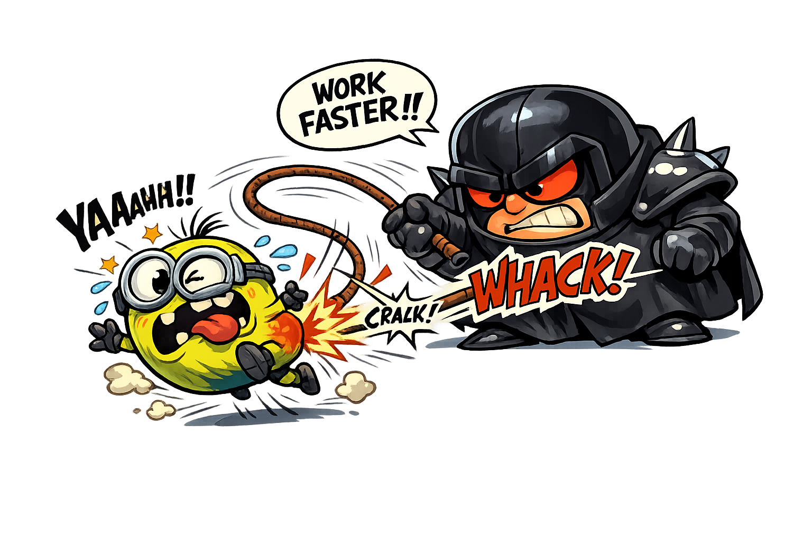
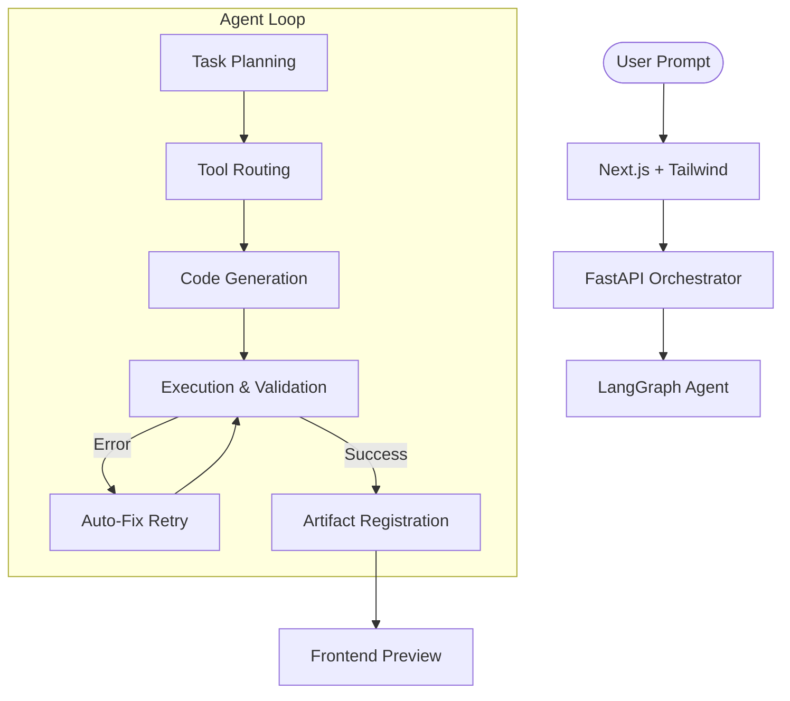

# 🍌 Data Minion

> **Transform raw data into insights with an intelligent, agentic workspace.**



Data Minion is an agent-driven data processing system that bridges the gap between complex datasets and natural language. Using a production-grade **LangGraph** orchestrator, it intelligently cleans, analyzes, and visualizes data based on simple user prompts.

---

## ✨ Features

- 🧠 **Multi-Step Planning**: Automatically breaks down complex natural language requests into atomic, executable data steps.
- 🛠️ **Self-Healing Execution**: LLM-guided code generation with an auto-fix loop that recovers from common pandas/python errors in real-time.
- 📦 **Artifact Management**: Immutable, versioned artifacts with full lineage tracking. Every transformation creates a new state, preserving your original data.
- 📊 **Dynamic Visualizations**: Generates professional charts and dashboards using Matplotlib and Seaborn based on derived insights.
- 🛡️ **Schema Protection**: Continually monitors schema changes and validates intentionality before proceeding with transformations.
- 💬 **Interactive Workspace**: A modern, streaming chat interface to interact with your data agents and view intermediate artifacts on the fly.

---

## 🏗️ Architecture

Data Minion follows an **Orchestrator-Worker** pattern:

1.  **Frontend (Next.js)**: A sleek dashboard for uploading CSVs and interacting with the agent.
2.  **API (FastAPI)**: Routes requests and serves artifacts.
3.  **Agent (LangGraph)**: The "brain" that plans, routes to tools (pandas, visualization, analysis), executes code, and validates results.



---

## 🔍 Example Queries

Try asking Data Minion things like:

- *"Clean this dataset and remove rows with missing patient IDs."*
- *"Show me a bar chart of cardiovascular risk by age group."*
- *"Calculate the correlation between blood pressure and cholesterol levels."*
- *"Generate an executive summary of the key risk factors in this data."*
- *"Create a new 'risk_score' column based on age and BMI."*

---

## 🛠️ Tech Stack

- **Backend**: Python 3.11+, LangGraph, LangChain, FastAPI, Pandas, Matplotlib, Seaborn, Pydantic.
- **Frontend**: Next.js 15, React, Tailwind CSS, Shadcn UI, Framer Motion.
- **Storage**: File-based artifact storage with local JSON metadata persistence.

---

## 🚀 Getting Started

### Prerequisites

- [uv](https://github.com/astral-sh/uv) (recommended for Python) or `pip`
- [Node.js](https://nodejs.org/) (v18+)
- OpenAI/Azure OpenAI API Key

### Backend Setup

1. Navigate to the backend directory:
   ```bash
   cd backend
   ```
2. Create and configure your `.env` file:
   ```bash
   AZURE_OPENAI_DEPLOYMENT_NAME=your-deployment
   AZURE_OPENAI_ENDPOINT=your-endpoint
   AZURE_OPENAI_API_KEY=your-api-key
   ```
3. Install dependencies and run the server:
   ```bash
   # Using uv
   uv run api.py
   
   # Or using pip
   pip install -r requirements.txt
   python api.py
   ```
   The API will be available at `http://localhost:8000`.

### Frontend Setup

1. Navigate to the frontend directory:
   ```bash
   cd frontend
   ```
2. Install dependencies:
   ```bash
   npm install
   ```
3. Start the development server:
   ```bash
   npm run dev
   ```
   The application will be available at `http://localhost:3000`.

---

## 📂 Project Structure

- `backend/`: LangGraph implementation, FastAPI routes, and agent logic.
- `frontend/`: Next.js application with Tailwind CSS and Shadcn UI.
- `design/`: System specifications and architectural decisions.
- `sample-data/`: Representative CSVs for testing the agent's capabilities.

---

## 📜 License

This project is licensed under the MIT License - see the [LICENSE](LICENSE) file for details.

---

Built with ❤️ by the Data Minion Team.
